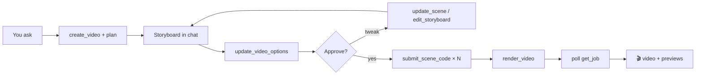

# Now I Get It ✨

[](https://nextjs.org/)
[](https://react.dev/)
[](https://www.python.org/)
[](https://fastapi.tiangolo.com/)
[](https://3b1b.github.io/manim/)
[](https://modelcontextprotocol.io/)
[](https://vercel.com/)
[](https://openrouter.ai/)
[](./LICENSE)

Turn a sentence into a **Manim explainer video** — or drop a PDF/deck and **quiz every slide**. Same engine in the browser **and** inside ChatGPT, Claude, and Cursor via a remote MCP connector.

> **New:** the chat connector is first-class. You write the storyboard, pick audio / subtitles / voice, then the host writes Manim and we render. Jobs land in your Library.

---

## Jump in

| I want to… | Go here |
|---|---|
| 🎬 Make a video in the browser | [Getting started](#getting-started) |
| 📄 Study a PDF / PPTX | [Understand](#understand) |
| 🔌 Use it from ChatGPT / Claude / Cursor | [MCP connector](#mcp) |
| 🧪 Inspect tools locally | [MCP Inspector](#inspector) |
| 🚀 Deploy | [Deploy](#deploy) |

---

## Try these (copy → paste)

Once the connector is on, drop one of these into chat:

```
Make a 60-second video that explains gradient descent on a parabola for undergrads.
Show me the storyboard first. I want spoken audio and burned-in subtitles. Voice: Kore.
```

```
Study this lecture PDF: https://example.com/notes.pdf
Then quiz me on slide 4, and turn the key formulas into a video prompt.
```

```
Find my last Fourier video, retouch scene 2 so the axes are labeled, then re-render only that scene.
```

On the website: open [http://localhost:3000](http://localhost:3000) after [Getting started](#-getting-started), sign in with Google, and type the same kind of prompt.

---

## What you get

### 🎬 Create (video)

LLM scene planning → Manim codegen → VLM frame review → TTS narration → stitched video.

You always see a **storyboard first**. Change scenes, narration, voice, audio, and subtitles before anything renders.

### 📄 Understand (documents) <a id="understand"></a>

[Docling](https://github.com/docling-project/docling) turns PDF / PPTX / DOCX into interactive HTML slides. Click a block for explanations, quizzes, figure readouts, formulas, misconceptions, or a video prompt.

### 🔌 ChatGPT / Claude / Cursor

The same Create + Understand APIs as a **remote MCP server** at `/api/mcp`. Setup page: **`/connect`**. Sign in with Google — no API key to paste. Videos and docs show up in **Library**.

### Also

- 📡 Live progress (streaming events while pipelines run)
- 🧬 Debug artifacts (full job history, scoped per user)
- 🔐 Google sign-in (Auth.js). Jobs and media stay per-account, including connector-created videos

---

## 🔌 MCP connector — ChatGPT, Claude & Cursor <a id="mcp"></a>

Remote **Streamable HTTP** MCP. The chat model writes the storyboard and Manim; this server validates, renders, narrates, and stitches.

**Production**

| | |
|---|---|
| Connector URL | `https://app-production-5eb7.up.railway.app/api/mcp` |
| Setup page | [https://app-production-5eb7.up.railway.app/connect](https://app-production-5eb7.up.railway.app/connect) |

Auth is **Google OAuth**. Leave client ID / secret empty (“register automatically”). Optional `MCP_CONNECTOR_TOKEN` is only for the local Inspector.

### Video loop (you stay in the driver’s seat)



1. Model writes a `plan` object and calls `create_video` (never stuff JSON inside `prompt`).
2. **Stop.** You see numbered scenes. Ask for changes if you want.
3. Pick **spoken audio**, **burned-in subtitles**, and **voice** → `update_video_options`.
4. After you approve: Manim for every scene (`video_codegen_spec` → `submit_scene_code`). `Text()` only — never `MathTex`.
5. `render_video` with `user_confirmed: true`. If `poll_again`, keep calling `get_job` with the **same** `job_id`. Don’t start a new job.
6. Preview images + VLM notes come back in the tool result. Use `retouch_scene` to fix one clip.

In-chat widgets: **job progress / storyboard**, **video player**, **slides tutor**.

### Document loop

`upload_document` (public HTTPS URL works best) → poll `get_document` until `ready` → `ask_document` (`explain`, `quiz`, `turn_into_video_prompt`, …).

### Connect in 2 minutes

<details>
<summary><strong>ChatGPT</strong> — Developer Mode custom connector</summary>

1. Settings → Security and login → turn on **Developer mode**.
2. Plugins / Connectors → add a custom connector.
3. Paste `https://<your-host>/api/mcp` (or the production URL above).
4. Auth: **OAuth**. No client ID, no bearer token. ChatGPT opens Google sign-in.
5. Start a **new chat** and enable **Now I Get It** from the tools menu.

Also add this app’s `/api/auth/callback/google` URL to your Google OAuth client (listed on `/connect`).

</details>

<details>
<summary><strong>Claude</strong> — Customize → Connectors</summary>

1. claude.ai → Customize → Connectors → **Add custom connector**.
2. Paste the same `/api/mcp` URL.
3. In the OAuth modal: **No client ID — register automatically**. Leave client ID, secret, and extra headers empty.
4. Enable the connector, then sign in with Google when Claude opens this site.

</details>

<details>
<summary><strong>Cursor</strong> — remote MCP</summary>

Add a remote server pointing at your connector URL (Streamable HTTP):

```json
{
  "mcpServers": {
    "nowigetit": {
      "url": "https://app-production-5eb7.up.railway.app/api/mcp"
    }
  }
}
```

Sign in with Google when Cursor prompts. Local HTTPS: tunnel `localhost:3000` first — ChatGPT/Claude need a public HTTPS origin.

</details>

### 🔬 Local Inspector <a id="inspector"></a>

```bash
npx @modelcontextprotocol/inspector@latest
```

Transport: **Streamable HTTP** · URL: `http://localhost:3000/api/mcp`  
Optional shared key: `MCP_CONNECTOR_TOKEN` (Inspector only).

### Tool catalog

<details>
<summary>🎬 Video tools</summary>

| Tool | What it does |
|---|---|
| `video_planning_spec` | ScenePlan JSON schema — then **you** write the plan |
| `create_video` | Save the storyboard (`plan` is a JSON **object** argument) |
| `update_video_options` | Spoken audio / subtitles / narrator voice (**required** after the plan) |
| `revise_plan` | Replace the whole storyboard JSON |
| `edit_storyboard` | Plain-English edits (“add a numeric example”) |
| `update_scene` | Tweak one scene’s title, narration, beats, … |
| `get_scene` | Narration, Manim, preview image, VLM notes |
| `video_codegen_spec` | Manim rules for one scene (after approval + options) |
| `submit_scene_code` | Save one complete Manim Community Scene file |
| `render_video` | Render after every scene has code (`user_confirmed: true`) |
| `continue_video` | Alias of `render_video` — prefer `render_video` |
| `retouch_scene` | Rewrite + re-render one scene after a clip exists |
| `get_job` | Poll. If `poll_again`, wait and call again with the **same** id |
| `list_jobs` | Recent videos for this Google account |

</details>

<details>
<summary>📄 Document tools</summary>

| Tool | What it does |
|---|---|
| `upload_document` | PDF/PPTX/DOCX → study slides (`file_url` or `file_base64`) |
| `list_documents` | Converted docs for this account |
| `get_document` | Slide titles, block ids, signed HTML URLs — also used to poll |
| `ask_document` | `explain`, `quiz`, `simplify`, `deepen`, `translate`, `extract_formula`, `misconceptions`, `turn_into_video_prompt`, `freeform`, … |

Max upload **25 MB**. Prefer a public HTTPS URL from chat clients.

</details>

<details>
<summary>📚 Library & quota</summary>

| Tool | What it does |
|---|---|
| `search` | Find videos/docs by title or prompt (ChatGPT library search) |
| `fetch` | Load a hit by `job:<id>` or `doc:<id>` |
| `get_usage` | Remaining generation / token / storage quota |

</details>

<details>
<summary>🛠️ Railway app service (public connector)</summary>

The Manim worker stays on the `NowIGetIt` Railway service. The chat connector is a **separate** `app` service (`Dockerfile.app` + `railway.app.toml`): Next.js + FastAPI, calling `RENDER_WORKER_URL` for video.

```bash
railway up --service app --environment production --ci
```

</details>

---

## Architecture

**Create**

```
Prompt → Plan → [Generate → Render → VLM → Revise] × N → TTS → Video
```

**Understand**

```
Upload → Docling (local or Railway) → HTML slides + block ids → LLM/VLM ask on selection
```

**Deploy split**

- **Vercel** — Next.js UI + FastAPI orchestration
- **Railway (Manim)** — `Dockerfile.railway` / `POST /render`
- **Railway (Docling)** — `Dockerfile.docling` / `POST /convert`
- **Local** — Manim via `ENABLE_MANIM_RENDER=true`; Docling via `pip install -r requirements-docling.txt` or `DOCLING_WORKER_URL`

**Stack:** Next.js · FastAPI · OpenRouter · Manim CE · Docling · SQLite or MongoDB Atlas + local files

### Layout

```
├── src/                    # Next.js App Router UI (/ = Create, /understand, /connect)
├── src/lib/mcp/            # Remote MCP tools, OAuth, in-chat widgets
├── api/index.py            # FastAPI entry (Vercel)
├── render_worker/          # Manim HTTP worker (Railway)
├── docling_worker/         # Docling HTTP worker (Railway)
├── backend/                # Video pipeline + documents/ (Understand)
├── Dockerfile.railway      # Railway Manim image
├── Dockerfile.docling      # Railway Docling image
├── requirements-render.txt
├── requirements-docling.txt
└── vercel.json
```

---

## 🚀 Getting started <a id="getting-started"></a>

### Prerequisites

- Node.js 20+
- Python **3.12** (Manim does not support 3.14 yet)
- [OpenRouter API key](https://openrouter.ai/)
- Optional for local video: ffmpeg, cairo, pango, glew

### 1. Environment

```bash
cp .env.example .env.local
cp .env.example .env
```

<details>
<summary>🔑 Environment variables</summary>

| Variable | Required | Description |
|----------|----------|-------------|
| `OPENROUTER_API_KEY` | Yes | OpenRouter API key |
| `OPENROUTER_MODEL` | No | General text LLM (documents / Understand) |
| `OPENROUTER_MODEL_MANIM` | No | Manim pipeline LLM (planning, codegen, code QA; falls back to `OPENROUTER_MODEL`) |
| `OPENROUTER_VLM_MODEL` | No | Vision model for frame review |
| `TTS_*` | No | OpenRouter TTS (defaults to Gemini 3.1 Flash TTS / voice `Kore`; key falls back to `OPENROUTER_API_KEY`) |
| `ENABLE_MANIM_RENDER` | No | `true` for local video output |
| `NEXT_PUBLIC_API_BASE_URL` | No | API origin (local: `http://127.0.0.1:8000`) |
| `AUTH_SECRET` | Yes | Shared secret for Auth.js + API JWTs (`openssl rand -hex 32`) |
| `AUTH_GOOGLE_ID` / `AUTH_GOOGLE_SECRET` | Yes | Google OAuth client credentials |
| `MCP_CONNECTOR_TOKEN` | No | Shared bearer for MCP Inspector only |
| `MONGODB_URI` | No | Atlas connection string. When set, users / Library / usage go to MongoDB |
| `MONGODB_DB` | No | Database name (default `nowigetit`) |
| `USE_SUPABASE` | No | Keep `false` unless you opt back into Supabase |

Default storage is **MongoDB Atlas + local files** when `MONGODB_URI` is set: users, Library, and usage live in MongoDB; videos stay under `ARTIFACTS_ROOT`. Without a URI, SQLite on disk is the fallback. Supabase remains optional.

</details>

<details>
<summary>🔐 Google OAuth setup</summary>

1. Create an OAuth client in [Google Cloud Console](https://console.cloud.google.com/apis/credentials) (type: Web application).
2. Authorized redirect URI: `http://localhost:3000/api/auth/callback/google` (and your production `https://…/api/auth/callback/google`).
3. Put the client ID/secret in `.env` and `.env.local` as `AUTH_GOOGLE_ID` / `AUTH_GOOGLE_SECRET`.
4. Use the **same** `AUTH_SECRET` in both Next.js and the FastAPI process (Python loads `.env`).

</details>

### 2. Python API

```bash
/opt/homebrew/bin/python3.12 -m venv .venv
source .venv/bin/activate
pip install -U pip setuptools==70.3.0 wheel
pip install -r requirements-local.txt   # API + Manim (local)
# Vercel uses pyproject.toml + uv.lock (API only). Manim is requirements-local.txt.

# macOS (if missing):
# brew install ffmpeg cairo pango pkg-config glew

npm run dev:api
```

### 3. Next.js

```bash
npm install
npm run dev
```

Open [http://localhost:3000](http://localhost:3000), sign in with Google, then generate. Connector setup: [http://localhost:3000/connect](http://localhost:3000/connect).

In development, Next rewrites job / generate / health routes to uvicorn when `NEXT_PUBLIC_API_BASE_URL` is unset; `/api/auth/*` and `/api/mcp` stay on Next.js.

Run both with `npm run dev:all`.

---

## API

Protected routes (except health) require `Authorization: Bearer <token>` from `GET /api/auth/api-token` after Google sign-in. Media file URLs may use `?access_token=`.

| Method | Path | Description |
|--------|------|-------------|
| `GET` | `/api/health` | Config / readiness |
| `GET` | `/api/auth/*` | Auth.js (Next.js) |
| `POST` | `/api/generate` | Full pipeline → JSON result |
| `POST` | `/api/generate/stream` | SSE live progress events |
| `GET` | `/api/jobs` | List **your** jobs |
| `GET` | `/api/jobs/{job_id}` | Job detail (owner only) |
| `GET` | `/api/jobs/{job_id}/file/...` | Artifact files |
| `GET/POST` | `/api/mcp` | ChatGPT / Claude / Cursor MCP connector (Streamable HTTP) |

**Example request body:**

```json
{
  "prompt": "Explain gradient descent on a parabola",
  "resolution": "720p",
  "skip_render": false
}
```

---

## Debug artifacts

Every run writes under `artifacts/{job_id}/`:

```
artifacts/{job_id}/
├── meta.json
├── scene_plan.json
├── events.jsonl
├── final_debug.json
├── result.json
└── scenes/{scene_id}/
    ├── section.json
    ├── code_r0.py … code_final.py
    ├── vlm_r0.json
    └── vlm_r0_frame.png
```

When Manim is off, a **storyboard frame** is generated so the VLM still receives an image. Browse via the UI debug inspector or the job file endpoints above.

---

## ☁️ Deploy <a id="deploy"></a>

Deploy as one Vercel project (Next.js + `api/index.py`):

1. Set `OPENROUTER_API_KEY`, optional `TTS_*`, and model overrides
2. Leave `NEXT_PUBLIC_API_BASE_URL` empty in production (same-origin `/api`)
3. `maxDuration` for the Python function **and** `/api/mcp` is `300`s in `vercel.json`

Or split frontend and API into two projects and point `NEXT_PUBLIC_API_BASE_URL` at the FastAPI URL.

---

## Legacy

The previous Streamlit app lives under [`legacy/`](./legacy/) for reference.

## License

**Proprietary — all rights reserved.** See [`LICENSE`](./LICENSE).

This project is **not** free to use. Company, commercial, organizational, and unpaid personal use are prohibited without a written paid license from the copyright holder. For licensing: amirrezaalasti@gmail.com

---

Built with Next.js, FastAPI, Manim, OpenRouter, and MCP. 💜
